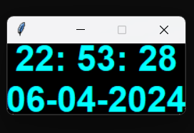

# Digital Clock 🕐


- This is a code for a simple  **digital clock** made in python with help of the **time** module and **Tkinter** library  


## How to run:

- Step 1: Clone the repo:
```
git clone https://github.com/optimizedLP/digital_clock
```
- Step 2: Run the following in terminal:
  ```
  cd digital_clock
  python digital_clock.py
  ```
  
## Output
--------
Once you run the code, it will render the following output:



